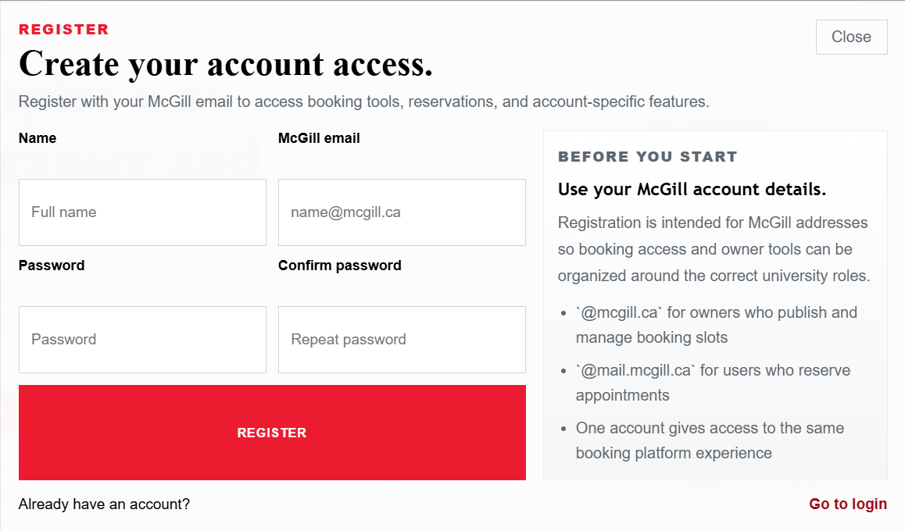

# SOCS Booking Application – Group 30

## Running Website URL

**URL:** https://winter2026-comp307-group30.cs.mcgill.ca/

The application is hosted on the McGill MIMI server and requires McGill VPN to access.

## Tech Stack

MERN (MongoDB, Express.js, React, Node.js)

- **Frontend:** React 18, Vite, React Router, plain CSS
- **Backend:** Node.js, Express.js, Mongoose, express-session
- **Database:** MongoDB
- **Deployment:** Node.js on MIMI (port 3000), serves the built React frontend from the same process

## Team Members

| Name                    | McGill ID   | Role              | Code Worked On                                                                                                                                                                                                                                                                                                                                                                                                                                                                                                                                                                                                                 |
|-------------------------|-------------|-------------------|-------------------------------------------------------------------------------------------------------------------------------------------------------------------------------------------------------------------------------------------------------------------------------------------------------------------------------------------------------------------------------------------------------------------------------------------------------------------------------------------------------------------------------------------------------------------------------------------------------------------------------|
| Stalbek Ulanbek uulu    | 261102435   | Frontend | All frontend pages, components, layouts, routing, and styling. Files: `App.jsx`, `main.jsx`, `styles.css`, `LandingPage.jsx`, `DashboardPage.jsx`, `OwnerAvailabilityPage.jsx`, `StudentOwnersPage.jsx`, `DashboardLayout.jsx`, `AccountPanel.jsx`, `BrandLink.jsx`, `HeroCalendar.jsx`, `ScheduleCalendar.jsx`, `SchedulePanel.jsx`, `PageHeader.jsx`, `BookingTypeFilter.jsx`, `BookingTypeButton.jsx`, `NotificationActions.jsx`, all `ownerAvailability/*` components, all `meeting/*` components, `feedback/*` components, `utils/date.js`, `utils/bookings.js`, deployment scripts, and overall project coordination. |
| Ananya Krishnakumar     | 261024261   | Backend           | Backend skeleton setup, Express/Node server initialization, backend dependencies, data models (`User.js`, `Slot.js`, `MeetingRequest.js`, `GroupMeeting.js`, `TeamRequest.js`), route definitions (`authRoutes.js`, `meetingRoutes.js`, `teamRoutes.js`), auth and meeting controllers, and frontend pages for the Team Finder feature.                                                                                                                                                                                                                                                                                        |
| Sterlande Herard        | 260987475   | Backend / Auth    | Session-based authentication implementation, MongoDB connection and server configuration (`db.js`, `server.js`), auth middleware (`authMiddleware.js`), slot route protection, frontend auth routing, and connecting frontend session context to the real backend auth flow.                                                                                                                                                                                                                                                                                                                                                     |
| Emerson Lin             | 261096196   | Backend / Slots   | Owner slot management endpoints, office hour creation logic, user booking flow, public slot browsing, invite code and ID-based slot retrieval endpoints, and meeting route integration.                                                                                                                                                                                                                                                                                                                                                                                                                                         |

## 30% Not Coded By the Team (AI-Generated / External)

1. **HeroCalendar component** (`src/components/HeroCalendar.jsx`) — The animated calendar visual on the landing page was written with AI assistance.
2. **ScheduleCalendar component** (`src/components/ScheduleCalendar.jsx`) — The reusable month calendar used in dashboard booking views was written with AI assistance.
3. **SchedulePanel component** (`src/components/SchedulePanel.jsx`) — The right-side schedule list panel on the dashboard were written with AI assistance.
4. **Utility helpers** (`src/utils/date.js`, `src/utils/bookings.js`) — Date formatting helpers and booking state logic were written with AI assistance.

